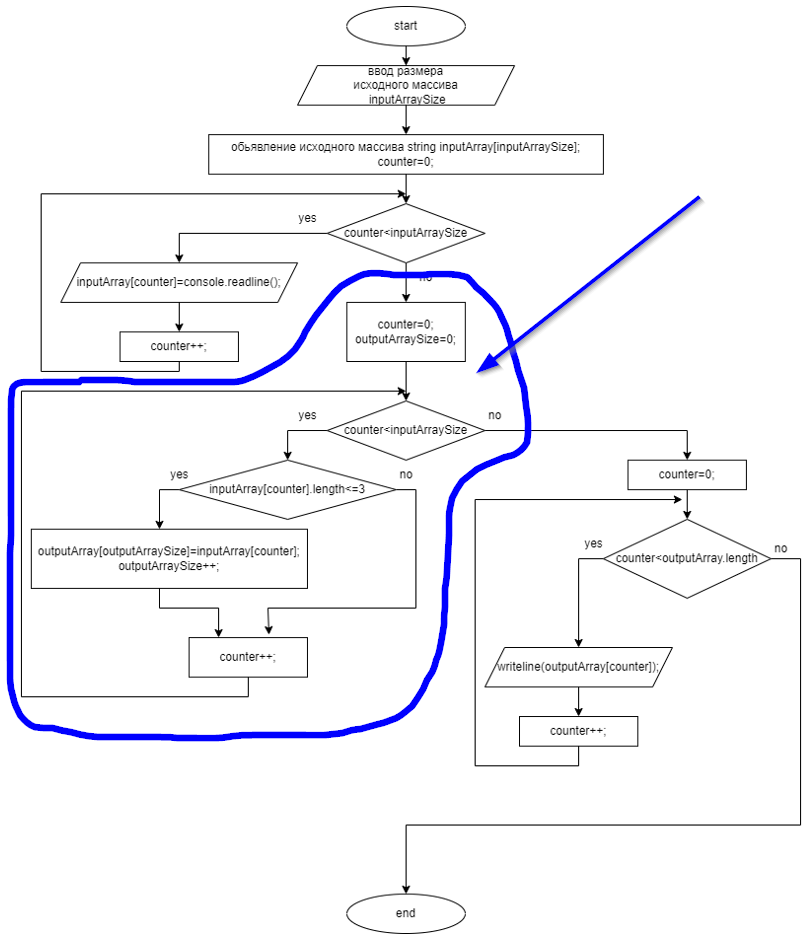

# Итоговая работа по результатам первой четверти

### ***Задание:*** _написать программу, которая из имеющегося массива строк формирует массив строк, длина которых меньше либо равна трем символам. первоначальный массив можно ввести с клавиатуры. При решении не рекомендуется пользоваться коллекциями, лучше обойтись исключительно массивами._
***
#### ***Промежуточные задачи:***
1. _Создать репозиторий на GitHub_
2. _Нарисовать блок-схему алгоритма (можно обойтись блок-схемой основной содержательной части, если она выделена в отдельный метод)_
3. _Снабдить репозиторий оформленным текстовым описаним решения (файл README.md)_
4. _Написать программу, решающую поставленную задачу_
5. _Использовать контроль версий в работе над проектом (как минимум этапы 2,3,4 должны быть расположены в разных коммитах)_
***
### Выполнение проекта
1. Создан репозиторий на GitHub https://github.com/KnstSpbOne/itog_1 .
Репозиторий с содержащимся файлом README.md клонирован на хост-машину. В получившейся рабочей папке создан новый проект Program.cs. Выполнен коммит изменений, также выполнена синхронизация изменений с удаленным репо.
2. Средствами редактора draw.io создана блок-схема алгоритма, файл itog_1.png добавлен в рабочую папку проекта, также в систему контроля версий, изменения зафиксированы коммитами, выполнен push  в удаленный репо.

Далее начата реализация алгоритма непосредственно средствами С#, то есть написание программы по _п.4 Промежуточных задач_ .

В первоначальном варианте реализации алгоритма часть, отвечающая за формирование результирующего массива (выделена на иллюстрации)

была решена двумя проходами по исходному массиву inputArray. В первом проходе подсчитывалось количество элементов, удовлетворяющих условию, то есть фактически вычислялась длина результирующего массива outputArraySize, которая затем использовалась для статического выделения памяти результирующему массиву outputArray. Вторым проходом выполнялось заполнение массива outputArray подходящими под условия элементами исходного массива inputArray.

Указанный вариант решения не представляется оптимальным, поэтому решено использовать методы класса System.Array, которые позволяют обьявить массив незаданной в явном виде длины и осуществить выборку подходящих элементов и заполнение результирующего массива в один проход (а в тексте программы и вообще без использования цикла).

Принято решение блок-схему алгоритма не менять, поскольку фактически использованный метод выполняет те же действия, что наверняка можно проследить по его описанию. Кроме того, блок-схема подчеркивает понимание процессов, выполняемых для получения искомого рзультата. Таким образом,

4. реализован написанием программы (текст в файле Program.cs), процесс написания сопровожден созданием коммитов и пушами в удаленный репо.

По завершению написания программы, ее отладки и первоначальному тестированию, отредактирован текст описательной части в файле README.md, то есть 

3. выполнен созданием описательной части решения и ее помещением в удаленный репозиторий

В процессе работы над проектом на всех этапах использовалась система контроля версий Git и удаленный репозиторий на GitHub,

5. отражен в поэтапной фиксации промежуточных состояний коммитами и заливке фалов проекта в удаленный репозиторий с помощью git push , что позволяет проследить историю изменений на каждом этапе

***_Таким образом, изложенное позволяет считать итоговую работу выполненной в полном объеме, с соблюдением поставленных граничных условий._***

